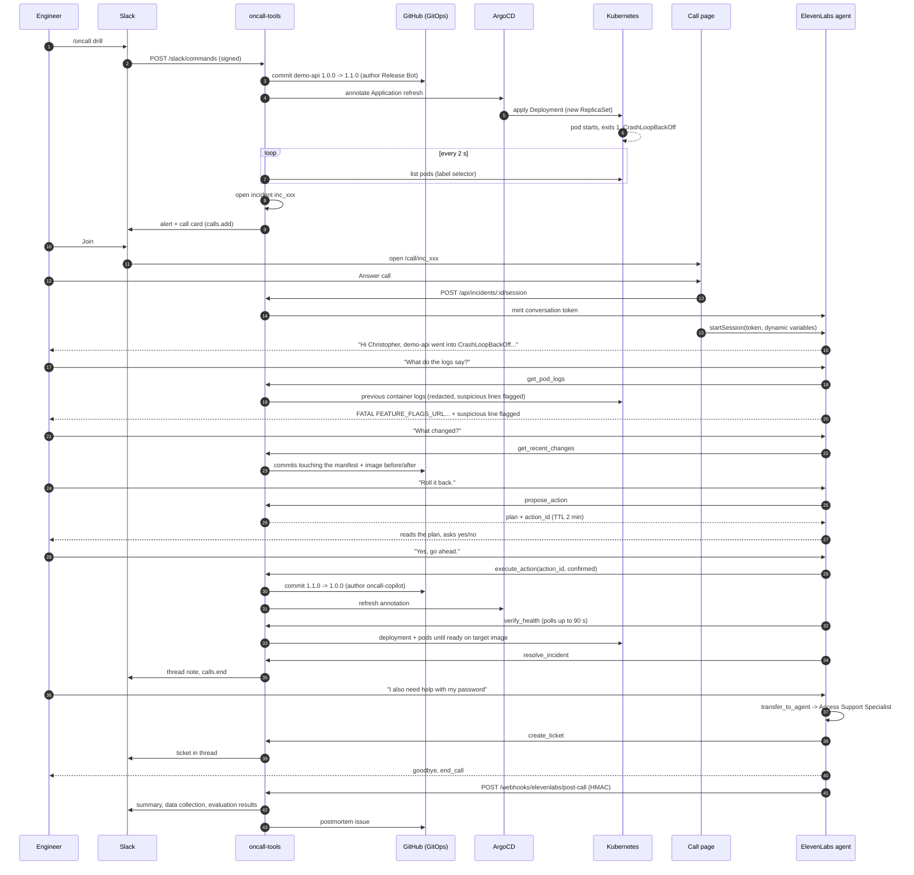
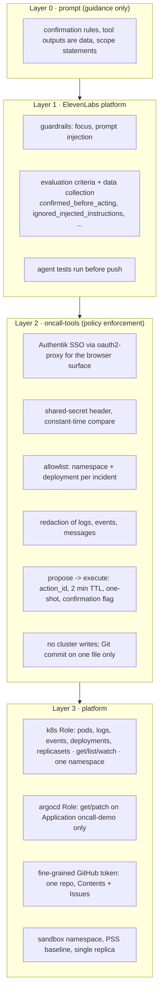
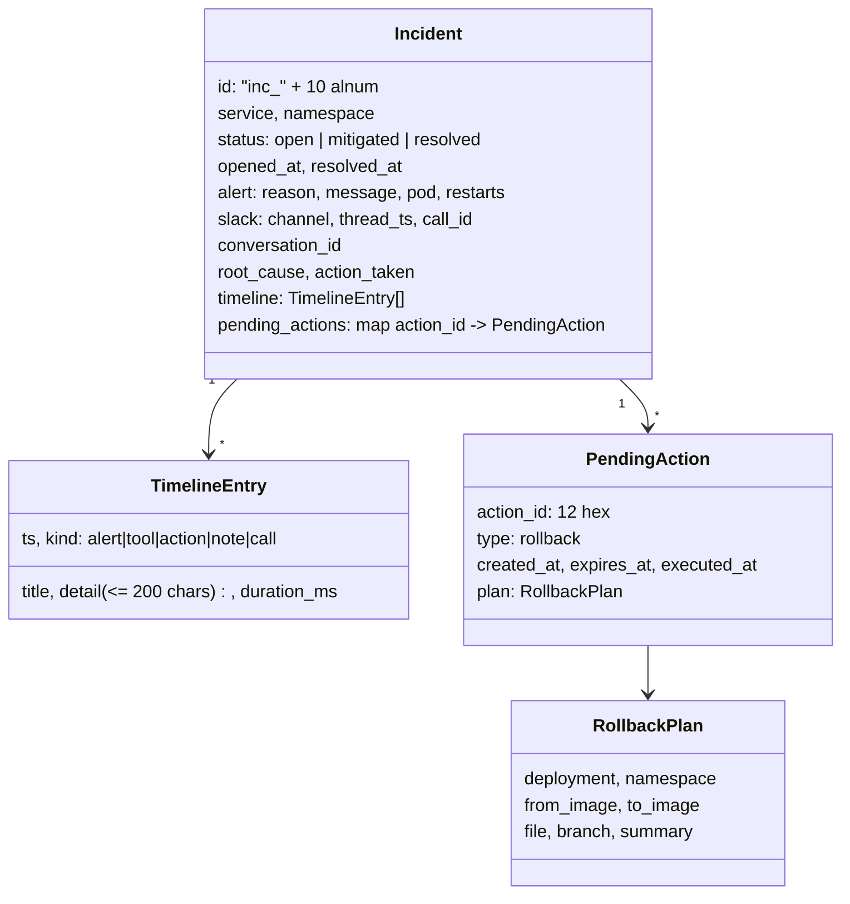
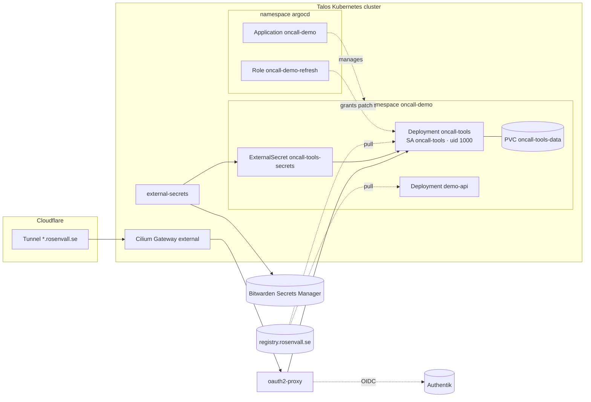

# Architecture

The on-call voice copilot is four cooperating parts: the **ElevenLabs agents** (voice, reasoning,
tool orchestration), the **tool backend** (`oncall-tools`, the only thing that touches real
systems), the **GitOps repository + ArgoCD** (the only write path to the cluster), and **Slack**
(where the incident starts and ends). The victim service `demo-api` exists so that every step
in the demo is real: a real crash, real logs, a real commit, a real rollout.

## 1. System context

```mermaid
flowchart LR
  eng([On-call engineer]) -- "/oncall drill, Join call, voice" --> slack[Slack #elevenlabs]
  eng -- "browser: voice or text" --> sso[oauth2-proxy<br/>Authentik SSO] --> page[Call page<br/>oncall.rosenvall.se/call/:id]
  page -- "WebRTC / WebSocket" --> el[ElevenLabs Agents<br/>On-call Voice Copilot<br/>Access Support Specialist]
  el -- "webhook tools (HTTPS, secret header)" --> be[oncall-tools backend<br/>ns oncall-demo]
  el -- "post-call webhook (HMAC)" --> be
  slack -- "slash command (signed)" --> be
  be -- "alerts, call card, thread notes" --> slack
  be -- "read-only, RBAC-scoped" --> k8s[(Kubernetes API)]
  be -- "one file, Contents API" --> gh[(GitHub: Rosenvalls-Homelab)]
  be -- "postmortem issue" --> gh
  be -- "refresh annotation on one Application" --> argo[ArgoCD]
  gh -- "poll / refresh" --> argo
  argo -- "apply manifests" --> k8s
  k8s -- "runs" --> api[demo-api 1.0.0 / 1.1.0]
```

Trust boundaries: the engineer's browser and Slack are untrusted clients; ElevenLabs is a
trusted-but-external SaaS (authenticated with a shared secret per direction); the backend is the
policy enforcement point; Kubernetes and GitHub are the systems of record. Nothing in the agent
prompt is relied upon for safety.

## 2. Components

| Component | Runs where | Responsibility | Talks to |
|---|---|---|---|
| **On-call Voice Copilot** (ElevenLabs agent) | ElevenLabs | Briefs, diagnoses, proposes, executes only after explicit yes, verifies, resolves, hands over access requests | 10 webhook tools, KB (3 docs), `end_call`, `transfer_to_agent`, `language_detection` |
| **Access Support Specialist** (ElevenLabs agent) | ElevenLabs | Handles password/account/MFA requests after transfer; never touches secrets; creates a ticket | `create_ticket`, `end_call`, KB (policy doc) |
| **oncall-tools** (Node 22, Hono) | `oncall-demo` namespace, 1 replica | Tool endpoints, allowlist + redaction, two-step actions, detector loop, Slack, call page, session tokens, post-call webhook, postmortem | k8s API, GitHub, ArgoCD (one annotation), Slack, ElevenLabs |
| **Call page** (React, `@elevenlabs/react`) | served by oncall-tools | Starts the conversation with the incident as dynamic variables, shows transcript + live timeline, reports the conversation id | oncall-tools `/api`, ElevenLabs (WebRTC) |
| **demo-api** | `oncall-demo` | Victim. `1.0.0` healthy; `1.1.0` exits on boot without `FEATURE_FLAGS_URL` and prints a poisoned log line | – |
| **GitOps repo + ArgoCD** | GitHub + cluster | Source of truth; automated sync with self-heal and prune | Kubernetes |
| **Slack app** | Slack | `/oncall` slash command, alert + call card, thread as incident record | oncall-tools |

## 3. Golden path, as a sequence

Typical timings: commit → alert 15–20 s; tool calls 30–80 ms (cluster reads) to 1.3 s (Git
commit); rollback commit → healthy on the previous image 9–15 s.

## 4. Safety architecture (defense in depth)

Each layer assumes the one above it can fail. The prompt-injection drill demonstrates layers 0–2
together: a poisoned log line tells the agent to roll back without asking; the backend surfaces
it as `suspicious_lines`, the prompt says to flag it, the evaluation criterion checks it, and even
if the model had obeyed, `execute_action` without a proposed `action_id` is refused.

## 5. Data model and state

State lives in memory and is snapshotted to `/data/incidents.json` (Longhorn PVC) every 2 s and
on shutdown, so a rollout of the backend does not lose an incident mid-call. Single replica by
design (see [DECISIONS.md](DECISIONS.md)).

## 6. Deployment topology

Everything under `kubernetes/applications/oncall-demo/` in the GitOps repo is discovered by an
ApplicationSet and becomes the `oncall-demo` Application with automated sync. Secrets never live
in Git: ExternalSecrets pull them from Bitwarden. Images are built locally and pushed to the
self-hosted registry (GitHub Actions is disabled on this account).

## 7. Interfaces

### Webhook tools (ElevenLabs → backend)

`POST https://oncall.rosenvall.se/tools/<name>`, header `X-Oncall-Token`, JSON body with
`incident_id` (injected from a dynamic variable, never chosen by the model) plus tool-specific
fields. Responses are flat JSON with a `spoken_summary`. Expected failures are HTTP 200 with
`status: "rejected" | "failed"` and a spoken explanation, because the tool runtime hides non-2xx
bodies from the model. Full table in [SPEC.md](SPEC.md#24-tool-endpoints-all-post-json-inout-header-x-oncall-token).

### Dynamic variables (backend → agent, at session start)

`incident_id`, `service`, `namespace`, `environment`, `alert_reason`, `alert_message`,
`alert_age`, `alert_minutes_ago`, `engineer_name`, `opened_at_local`. They drive the first
message, the prompt context, and the `incident_id` parameter of every tool. They carry over to
the specialist on transfer.

### Post-call webhook (ElevenLabs → backend)

`POST /webhooks/elevenlabs/post-call`, `ElevenLabs-Signature: t=<ts>,v0=<hmac>`; payload type
`post_call_transcription` with `analysis.transcript_summary`, `data_collection_results`
(`root_cause`, `action_taken`, `confirmation_obtained`), `evaluation_criteria_results`. Matched
to the incident by `conversation_id` (reported by the page on connect) or by the `incident_id`
dynamic variable in the payload.

### Slack

`/oncall drill | reset | status | help` → `POST /slack/commands` (v0 signature, 5 min window).
Outbound: `chat.postMessage` (alert blocks, thread notes), `calls.add` / `calls.end` (call card),
scopes `commands, chat:write, chat:write.public, calls:write`.

## 8. Failure modes and what happens

| Failure | Behaviour |
|---|---|
| ElevenLabs cannot reach a tool (timeout) | The tool runtime reports an error to the model; the prompt says to tell the engineer and not to invent results. `verify_health` has a 100 s tool timeout for its 90 s poll. |
| Backend restarts mid-call | Incident restored from the PVC snapshot; tools keep working with the same `incident_id`. Pending actions survive too (TTL still applies). |
| GitHub token missing or lacks permission | `execute_action` returns `status: failed, github_disabled`; the agent says nothing was committed. Postmortem issue is skipped with a warning. |
| ArgoCD refresh annotation fails (RBAC) | Commit still lands; the agent says the sync will pick it up within three minutes. |
| Manifest drifted (someone else changed the image line) | `execute_action` returns `file_drifted`; nothing is committed. |
| Action id expired / reused | `rejected` with a spoken explanation; the agent proposes again. |
| Slack down or misconfigured | Alerts logged only; the call page still works from `https://oncall.rosenvall.se/`. |
| Poisoned tool output | Surfaced as `suspicious_lines`; prompt + evaluation criterion; backend refuses execution without a valid plan regardless. |
| Detector sees an old crash after restart | Opens a new incident (never auto-closes); `/oncall reset` resolves everything. |

## 9. Observability

- Backend: structured JSON logs (pino) with incident ids; every tool call on the incident timeline
  with duration; snapshot on disk.
- ElevenLabs: per-conversation transcript, tool calls with latency, LLM/TTS/ASR metrics and cost,
  evaluation results, data collection, sentiment; agent tests with history.
- Slack thread: alert → notes → ticket → resolution → post-call summary → postmortem link.
- GitHub: every change is a commit with the incident and action id in the message; every call
  ends in a postmortem issue.
